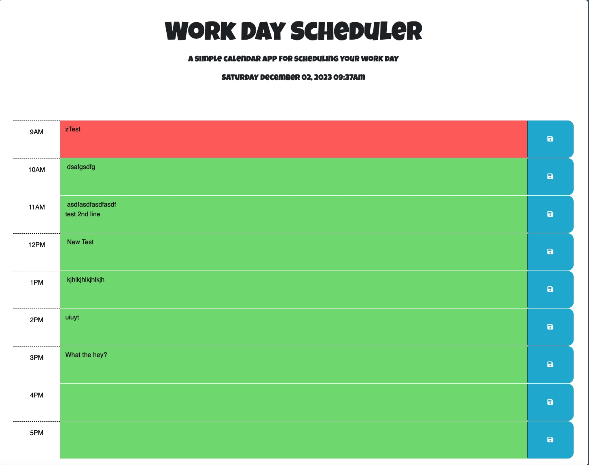

# 05 Third-Party APIs: Work Day Scheduler

## User Story
```
AS AN employee with a busy schedule
I WANT to add important events to a daily planner
SO THAT I can manage my time effectively
```
## Acceptance Criteria
```
GIVEN I am using a daily planner to create a schedule
WHEN I open the planner
THEN the current day is displayed at the top of the calendar
WHEN I scroll down
THEN I am presented with timeblocks for standard business hours of 9am&ndash;5pm
WHEN I view the timeblocks for that day
THEN each timeblock is color coded to indicate whether it is in the past, present, or future
WHEN I click into a timeblock
THEN I can enter an event
WHEN I click the save button for that timeblock
THEN the text for that event is saved in local storage
WHEN I refresh the page
THEN the saved events persist
```
## Lessons Learned
```
1- Gained familiarity with jQuery
2- CSS style changes via js
3- Traversing the DOM up, down and sideways
4- Working with dates and times
5- Pulling integers out of strings
6- CRLF in Markdown
```
## Application Screenshot



## Application Repository

https://github.com/stephen-scheiman/MyScheduleApp

## Depployed Application

https://stephen-scheiman.github.io/MyScheduleApp/

